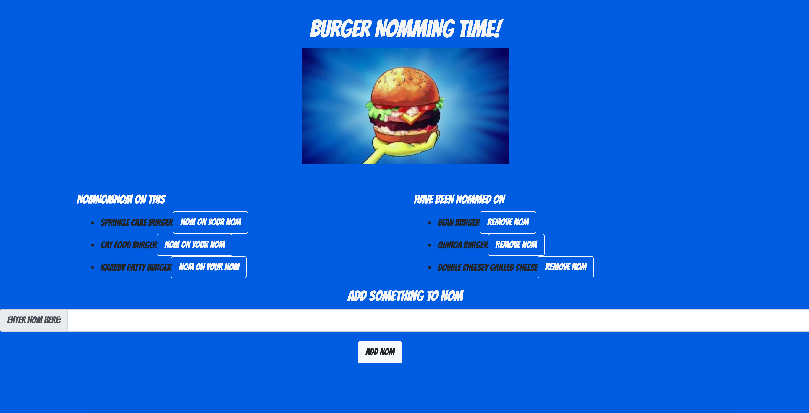

# burger

## Use
A full stack application using MySQL, Node, Express, Handlebars, and ORM. This application adds burgers logged by the user. The user can eat the burgers by clicking the "NOM ON YOUR NOM" button next to the burger type. 

## Application
Deployed link (on Heroku) --------------------------> https://fathomless-headland-96435.herokuapp.com/

## How to Use the App
Type in a burger type that you would like to eat. Click the "ADD NOM" button. The burger will be added to your list, "NOMNOMNOM ON THIS". To eat your burger, click the "NOM ON YOUR NOM" button next to the burger you'd like to eat. Once you eat the burger, it will be added to a different list, "HAVE BEEN NOMMED ON" on the right of the screen. You can remove a burger from this list by clicking the "REMOVE NOM" button.

## Technologies Used
1. MySQL
2. Node
3. Express
4. Handlebars
5. ORM
6. CSS
7. Javascript
